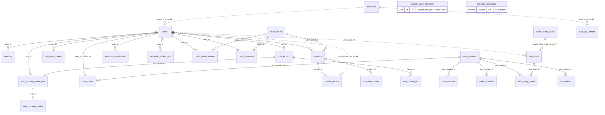
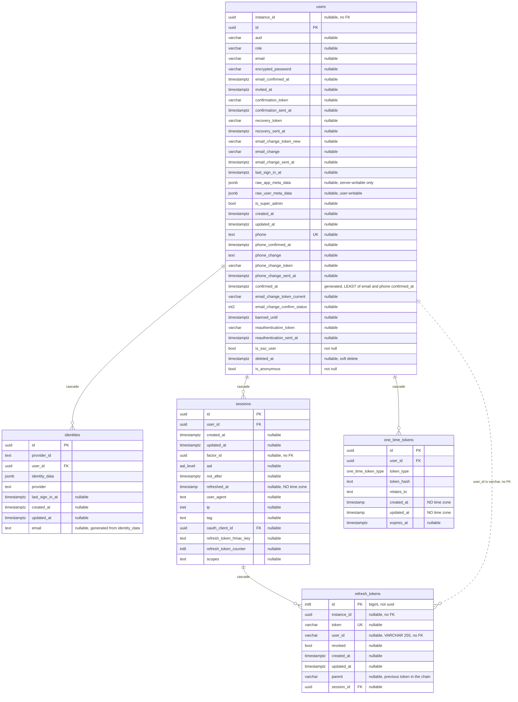
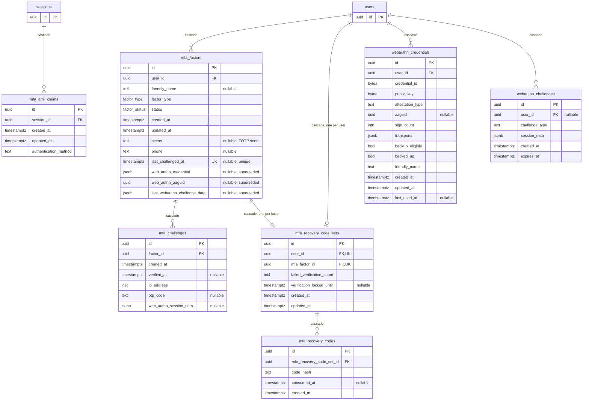
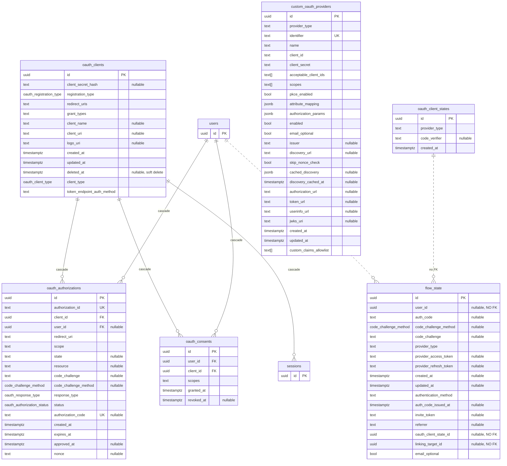
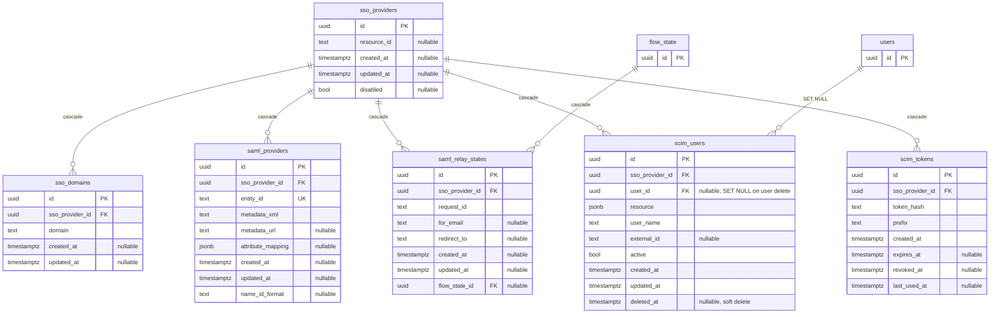
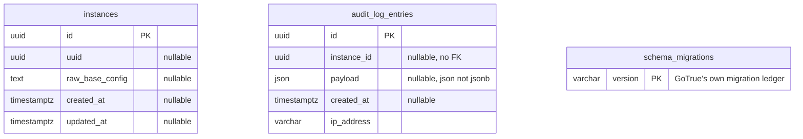

# Supabase auth schema

Supabase's own `auth` schema — GoTrue's tables, not yours. You do not migrate
them and you should not write to them; they are drawn here because everything in
[`database-schema.md`](./database-schema.md) hangs off `auth.users`, and that
diagram carries it as a one-column stub.

Twenty-seven tables. Too many for one picture, so: a map first, then each
cluster with its columns.

**Where this came from.** Columns, types and nullability are from the schema
dump. The foreign keys are not — the dump carries none, so they were read from
the live database (`pg_constraint`, project `alined-3d-sketch`) with
[the query at the bottom](#the-query-that-produced-the-edges). All twenty-four
are drawn solid. Dashed lines are links that exist in name only: a column that
points at another table with nothing enforcing it.

## The whole schema



## Identity and session



## Multi-factor



## Login flows and OAuth



## Enterprise SSO and SCIM



## Bookkeeping

Three tables with no foreign keys in either direction.



## Enums

| Type | Values |
|---|---|
| `aal_level` | `aal1`, `aal2`, `aal3` |
| `factor_type` | `totp`, `webauthn`, `phone`, `recovery_code` |
| `factor_status` | `unverified`, `verified` |
| `code_challenge_method` | `s256`, `plain` |
| `one_time_token_type` | `confirmation_token`, `reauthentication_token`, `recovery_token`, `email_change_token_new`, `email_change_token_current`, `phone_change_token` |
| `oauth_registration_type` | `dynamic`, `manual` |
| `oauth_authorization_status` | `pending`, `approved`, `denied`, `expired` |
| `oauth_response_type` | `code` |
| `oauth_client_type` | `public`, `confidential` |

## What the diagram cannot say

- **Deleting a user empties almost everything.** Twenty-three of the twenty-four
  foreign keys are `ON DELETE CASCADE`. The exception is `scim_users.user_id`,
  which is `SET NULL` — delete a user and their SCIM record stays, deactivated
  from the identity provider's side but still on the table with a null
  `user_id`. It is the only row in the schema that outlives its user by design.
- **`refresh_tokens.user_id` is `varchar(255)`, not `uuid`.** It holds the user id as
  text, so no foreign key is possible and none exists. Refresh tokens are still
  torn down with the user, but indirectly: `sessions` cascades from `users`, and
  `refresh_tokens` cascades from `sessions`. A token whose `session_id` is null
  is not reachable by that chain.
- **Three columns that look like foreign keys are not.** `flow_state.user_id`,
  `flow_state.oauth_client_state_id` and `flow_state.linking_target_id` all name
  another table and none is constrained — confirmed by their absence from
  `pg_constraint`. `sessions.factor_id` is the same. `flow_state` rows are
  short-lived and swept on a timer, so nothing cascades into them.
- **`instance_id` is a vestige.** It appears on `users`, `refresh_tokens` and
  `audit_log_entries`, always nullable and never constrained. It is left from
  GoTrue's multi-tenant days; on a single Supabase project `instances` is empty
  and the column stays null.
- **Two generations of WebAuthn.** `mfa_factors` still carries
  `web_authn_credential`, `web_authn_aaguid` and `last_webauthn_challenge_data`,
  while `webauthn_credentials` and `webauthn_challenges` hold the same thing
  properly. New passkeys land in the tables; the `mfa_factors` columns are
  legacy.
- **Timestamps are not uniformly timestamptz.** `sessions.refreshed_at` and both
  `one_time_tokens` timestamps are bare `timestamp`, with no time zone, in a
  schema that is otherwise `timestamptz` throughout.
- **`users.confirmed_at` is generated** — `LEAST(email_confirmed_at,
  phone_confirmed_at)`. Writes to it fail.
- **`users.deleted_at` and the soft deletes.** `users`, `oauth_clients` and
  `scim_users` each carry a `deleted_at`. A soft-deleted user is still a row, so
  the cascades above have not fired and their sessions may still exist.
- **`mfa_factors.last_challenged_at` is unique** — a unique constraint on a
  timestamp, which means no two factors anywhere in the project may record the
  exact same challenge instant.
- **`raw_app_meta_data` vs `raw_user_meta_data`.** The first is writable only
  server-side and is the safe place for roles or claims; the second is writable
  by the user through the client SDK and must never be trusted for
  authorization.

## The query that produced the edges

```sql
select
  c.conrelid::regclass::text as child,
  (select string_agg(a.attname, ',' order by k.ord)
     from unnest(c.conkey) with ordinality k(attnum, ord)
     join pg_attribute a on a.attrelid = c.conrelid and a.attnum = k.attnum) as child_cols,
  c.confrelid::regclass::text as parent,
  (select string_agg(a.attname, ',' order by k.ord)
     from unnest(c.confkey) with ordinality k(attnum, ord)
     join pg_attribute a on a.attrelid = c.confrelid and a.attnum = k.attnum) as parent_cols,
  case c.confdeltype
    when 'a' then 'no action' when 'c' then 'cascade' when 'n' then 'set null'
    when 'r' then 'restrict'  when 'd' then 'set default' end as on_delete
from pg_constraint c
where c.contype = 'f'
  and c.connamespace = 'auth'::regnamespace
order by parent, child;
```

Supabase upgrades this schema without asking. Re-run the query after an upgrade
and the edges above can be checked in one pass.
