# Database schema

The alined app's Supabase Postgres database: every table in `public`, its
columns, and the links between them. `auth.users` is Supabase's own table —
drawn here as `auth_users`, and only as the anchor the rest hangs from. It has a
diagram of its own in [`auth-schema.md`](./auth-schema.md), along with the other
twenty-six tables of the `auth` schema.

```mermaid
erDiagram
    %% identity and tenancy
    auth_users {
        uuid id PK "Supabase-managed"
    }

    user_profiles {
        uuid user_id PK,FK
        text username UK "3-30 chars, lowercase"
        text name "1-100 chars"
        text firm_name "1-200 chars"
        text city "1-100 chars"
        text phone UK "E.164"
        text email_cached
        timestamptz created_at
        timestamptz updated_at
    }

    user_consents {
        uuid user_id PK,FK
        boolean telemetry "default true"
        timestamptz telemetry_at
        integer telemetry_version
        timestamptz updated_at
    }

    orgs {
        uuid id PK
        text name
        timestamptz created_at
        uuid created_by FK
        boolean is_personal "default false"
    }

    org_members {
        uuid org_id PK,FK
        uuid user_id PK,FK
        text role "owner / editor / viewer"
        timestamptz created_at
    }

    %% the drawing itself
    projects {
        uuid id PK
        uuid org_id FK
        uuid owner_id FK
        text name "default 'Untitled project'"
        text units "metric / imperial"
        timestamptz created_at
        timestamptz updated_at
    }

    drawing_current {
        uuid project_id PK,FK
        integer version "default 1"
        timestamptz updated_at
        uuid updated_by FK
        text geometry_path "nullable, storage key"
        text reference_path "nullable, storage key"
    }

    drawing_revisions {
        uuid id PK
        uuid project_id FK
        integer version
        timestamptz created_at
        uuid created_by FK
        text geometry_path "nullable, storage key"
        text reference_path "nullable, storage key"
    }

    %% instrumentation
    telemetry_sessions {
        text session_id PK
        uuid user_id FK
        text hashed_user_id
        text r2_key UK
        timestamptz started_at
        timestamptz sealed_at
        timestamptz uploaded_at
        integer duration_ms
        integer event_count
        integer stroke_count
        integer size_bytes
        text app_version
        text device_class "tablet / phone / desktop"
        integer schema_version "default 1"
        text scene_id "nullable"
        uuid project_id "nullable, no FK"
    }

    correction_events {
        uuid id PK
        text session_id "no FK"
        uuid user_id FK "nullable"
        text element_type "nullable"
        text element_id "nullable"
        text kind
        jsonb before_state "nullable"
        jsonb after_state "nullable"
        text cascade_of "nullable"
        bigint client_ts "nullable"
        timestamptz created_at
    }

    usage_costs {
        uuid user_id PK,FK
        date day PK
        numeric total_usd
        integer call_count
        timestamptz updated_at
    }

    %% support
    support_threads {
        uuid id PK
        uuid user_id FK
        text kind "message / recording / screenshot"
        text subject "nullable, max 2000"
        text status "new / seen / investigating / resolved"
        integer founder_unread_count
        integer user_unread_count
        jsonb context "default empty object"
        timestamptz created_at
        timestamptz updated_at
        timestamptz last_message_at
    }

    support_messages {
        uuid id PK
        uuid thread_id FK
        text author_role "user / founder"
        uuid author_id FK "nullable"
        text body "nullable, max 10000"
        text recording_path "nullable, storage key"
        text recording_mime "nullable"
        bigint recording_bytes "nullable"
        integer recording_duration_ms "nullable"
        timestamptz telegram_notified_at "nullable"
        text telegram_error "nullable"
        timestamptz created_at
        timestamptz recording_deleted_at "nullable"
    }

    auth_users ||--o| user_profiles : "has"
    auth_users ||--o| user_consents : "has"
    auth_users ||--o{ orgs : "created"
    auth_users ||--o{ org_members : "is"
    orgs ||--o{ org_members : "has"
    orgs ||--o{ projects : "holds"
    auth_users ||--o{ projects : "owns"
    projects ||--o| drawing_current : "has one live"
    projects ||--o{ drawing_revisions : "keeps"
    auth_users ||--o{ drawing_current : "last saved"
    auth_users ||--o{ drawing_revisions : "saved"
    auth_users ||--o{ telemetry_sessions : "recorded"
    auth_users ||--o{ correction_events : "may have made"
    auth_users ||--o{ usage_costs : "accrues"
    auth_users ||--o{ support_threads : "opened"
    support_threads ||--o{ support_messages : "contains"
    auth_users ||--o{ support_messages : "may have written"
    projects ||..o{ telemetry_sessions : "tagged with, no FK"
```

## How it hangs together

Four clusters, all of them rooted in `auth.users`:

- **Identity and tenancy** — `user_profiles` and `user_consents` are one row per
  user each. `orgs` plus `org_members` carry the tenancy; a user's personal org
  is just an org with `is_personal` set.
- **The drawing** — `projects` belongs to an org and to an owner.
  `drawing_current` is keyed by `project_id`, so there is exactly one live
  drawing per project; `drawing_revisions` is the same shape without that
  constraint, and holds the history.
- **Instrumentation** — `telemetry_sessions` indexes recordings held in R2,
  `correction_events` logs individual edits, `usage_costs` rolls spend up per
  user per day.
- **Support** — `support_threads` with `support_messages` beneath them, each
  message either the user's or the founder's.

## What the diagram cannot say

- **Soft links are dashed.** `telemetry_sessions.project_id` names a project but
  carries no foreign key, so a deleted project leaves the row standing.
  `telemetry_sessions.scene_id` and `correction_events.session_id` are likewise
  plain text — the latter is *not* a foreign key to
  `telemetry_sessions.session_id`, and correction events can outlive the session
  that produced them.
- **Paths are keys, not content.** `geometry_path`, `reference_path`,
  `recording_path` and `r2_key` point into object storage; nothing in Postgres
  enforces that the object is there. The buckets they land in, and the policies
  guarding them, are in [`storage-schema.md`](./storage-schema.md).
- **Composite keys.** `org_members` is keyed `(org_id, user_id)` — one role per
  user per org. `usage_costs` is keyed `(user_id, day)` — one row per user per
  day, updated in place. `drawing_revisions` has **no** unique constraint on
  `(project_id, version)`; nothing at the database level stops a version number
  repeating.
- **Nullable authorship.** `correction_events.user_id` and
  `support_messages.author_id` both allow null, so telemetry and founder-side
  messages survive without a user attached.
- **Check constraints**, in full:
  - `user_profiles.username` — `^[a-z0-9_]{3,30}$`, unique.
  - `user_profiles.phone` — `^\+[1-9][0-9]{6,14}$`, unique.
  - `org_members.role` — `owner`, `editor`, `viewer`.
  - `projects.units` — `metric`, `imperial`.
  - `telemetry_sessions.device_class` — `tablet`, `phone`, `desktop`.
  - `support_threads.kind` — `message`, `recording`, `screenshot`.
  - `support_threads.status` — `new`, `seen`, `investigating`, `resolved`.
  - `support_messages.author_role` — `user`, `founder`.
