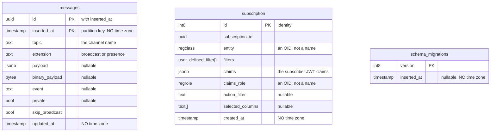
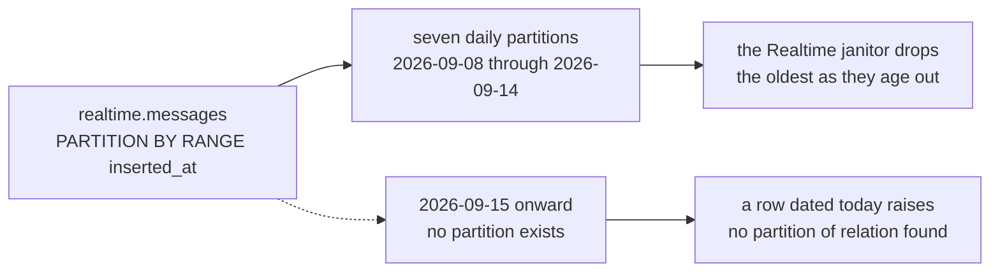
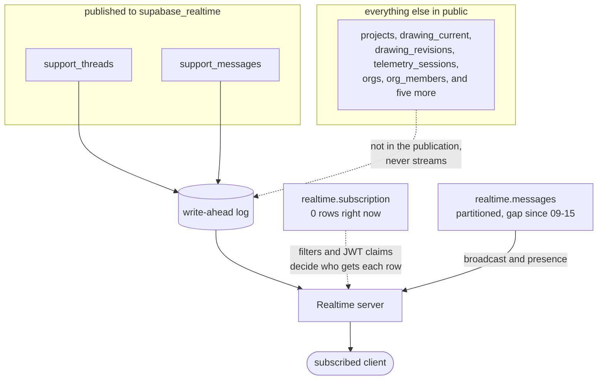

# Supabase realtime schema

Supabase's `realtime` schema — the live-update machinery. Three tables, not ten:
`messages` is partitioned by day, and the seven `messages_2026_09_*` tables in
the dump are its partitions, not tables of their own.

The schema has **zero foreign keys**. Its only structure is partition
inheritance, which ER notation cannot express, so the diagrams below are drawn
to the mechanism instead. Companion to
[`database-schema.md`](./database-schema.md),
[`auth-schema.md`](./auth-schema.md) and
[`storage-schema.md`](./storage-schema.md).

Constraints, partition bounds, RLS state and publication membership were read
from the live database — [queries at the bottom](#the-queries-behind-this-file).

## The three tables



No lines between them: there are no foreign keys anywhere in the schema, and
none of the three references another.

`messages.id` and `inserted_at` form a composite primary key because Postgres
requires the partition key to appear in every unique constraint on a partitioned
table. Every timestamp in this schema is bare `timestamp`, without a time zone.

### Types

| Type | Definition |
|---|---|
| `equality_op` | `eq`, `neq`, `lt`, `lte`, `gt`, `gte`, `in`, `like`, `ilike`, `is`, `match`, `imatch`, `isdistinct` |
| `action` | `INSERT`, `UPDATE`, `DELETE`, `TRUNCATE`, `ERROR` |
| `user_defined_filter` | composite: `column_name text`, `op equality_op`, `value text`, `negate boolean` |

`subscription.filters` is an array of that composite. The live type also carries
a dropped column between `value` and `negate`, and `negate` itself appears in no
Supabase documentation — it is there, and it is the fourth live field.

## messages is partitioned by day



Each partition covers exactly one day — `FOR VALUES FROM '2026-09-08 00:00:00'
TO '2026-09-09 00:00:00'`, and so on. There is no `DEFAULT` partition, so a row
whose `inserted_at` falls outside every range is rejected rather than parked.

**Today is 2026-09-18 and the newest partition ends at 2026-09-15 00:00.**
Nothing covers the last three days. Writing a persisted broadcast message right
now would fail.

The likely reading is benign: Realtime's maintenance task creates partitions
ahead and drops them behind while a tenant is connected, and this project has
had no Realtime traffic since the 14th — `realtime.subscription` holds zero
rows. Reconnecting should make the janitor catch up. It is worth a glance rather
than alarm, and the check is one query:

```sql
-- Realtime names each partition messages_YYYY_MM_DD
select to_regclass('realtime.messages_' || to_char(now(), 'YYYY_MM_DD')) is not null
       as partition_covers_today;
```

It returns false today.

**This does not affect the support inbox.** Those updates travel by a different
road, below.

## What actually streams



The `supabase_realtime` publication carries exactly two tables —
`public.support_threads` and `public.support_messages` — for insert, update and
delete. Nothing else in `public` is published, so nothing else streams. If live
drawing collaboration is ever expected, `drawing_current` is not in the
publication and that is why it is silent.

The two paths are worth keeping apart:

- **Postgres changes** — publication, WAL, `realtime.subscription`. This is what
  carries the support inbox. It does not touch `realtime.messages`, so the
  partition gap above cannot affect it.
- **Broadcast and presence** — `realtime.messages`. Persisted broadcast writes
  rows here, which is what the partition gap would block.

## What the diagram cannot say

- **`entity` and `claims_role` are OIDs, not names.** `regclass` and `regrole`
  store the numeric identity of a table and a role. Drop and recreate a
  published table and any stored subscription pointing at it no longer resolves
  to the same object. It also means `realtime.subscription` does not survive a
  dump and restore in any meaningful way, which is fine — the Realtime server
  rebuilds it from live connections.
- **`realtime.messages` has RLS enabled and zero policies.** That is deny-all
  for `authenticated` and `anon`, so private channels are closed to everyone
  today. Broadcast or presence on a private topic needs policies written against
  `realtime.messages`; the topic name is the only thing a policy has to work
  with, so the channel naming scheme becomes the authorization scheme — the same
  pattern as the storage paths in
  [`storage-schema.md`](./storage-schema.md#what-the-policies-actually-do).
- **`subscription` and `schema_migrations` have RLS disabled.** `subscription`
  holds subscribers' JWT claims in a `jsonb` column. The `realtime` schema is
  not exposed through PostgREST, so this is not reachable from a client, but it
  is a reason not to expose it.
- **Every published table uses `REPLICA IDENTITY DEFAULT`**, so update and
  delete events carry only the primary key in their `old` record. A client that
  needs to know what a support message said *before* an edit will not get it
  from the stream; that needs `REPLICA IDENTITY FULL` on the table, at the cost
  of a fatter WAL.
- **The partitions are in a publication too.**
  `supabase_realtime_messages_publication` lists the same seven dated
  partitions. New partitions have to be added to it as they are created, which
  is the janitor's job and another thing the gap since the 14th has not been
  doing.

## The queries behind this file

```sql
-- partition strategy and every partition's bounds
select pg_get_partkeydef('realtime.messages'::regclass);
select c.relname, pg_get_expr(c.relpartbound, c.oid)
from pg_class c join pg_inherits i on i.inhrelid = c.oid
where i.inhparent = 'realtime.messages'::regclass;

-- foreign keys in the schema (returns 0)
select count(*) from pg_constraint where contype = 'f'
  and connamespace = 'realtime'::regnamespace;

-- RLS state and policy counts
select c.relname, c.relrowsecurity,
       (select count(*) from pg_policy p where p.polrelid = c.oid)
from pg_class c join pg_namespace n on n.oid = c.relnamespace
where n.nspname = 'realtime' and c.relkind in ('r', 'p');

-- what is actually published, and how much each row carries
select pubname, schemaname, tablename from pg_publication_tables;
select relname, relreplident from pg_class c join pg_namespace n
  on n.oid = c.relnamespace where n.nspname = 'public' and c.relkind = 'r';
```
