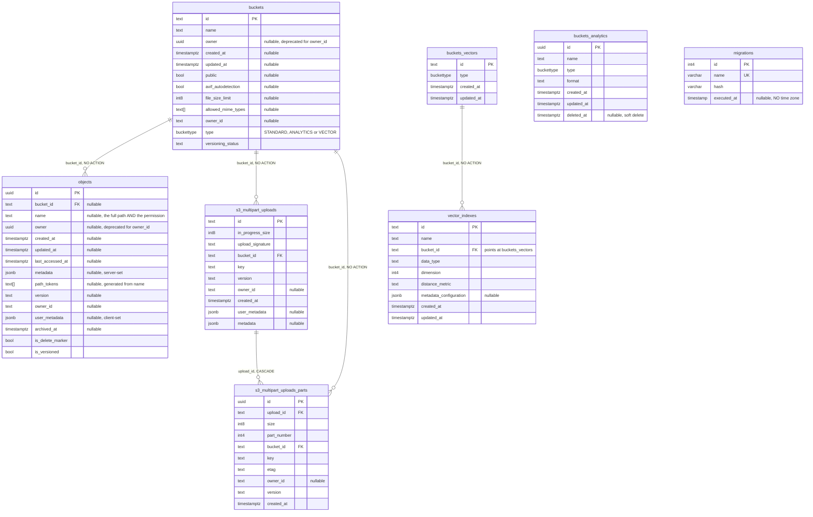
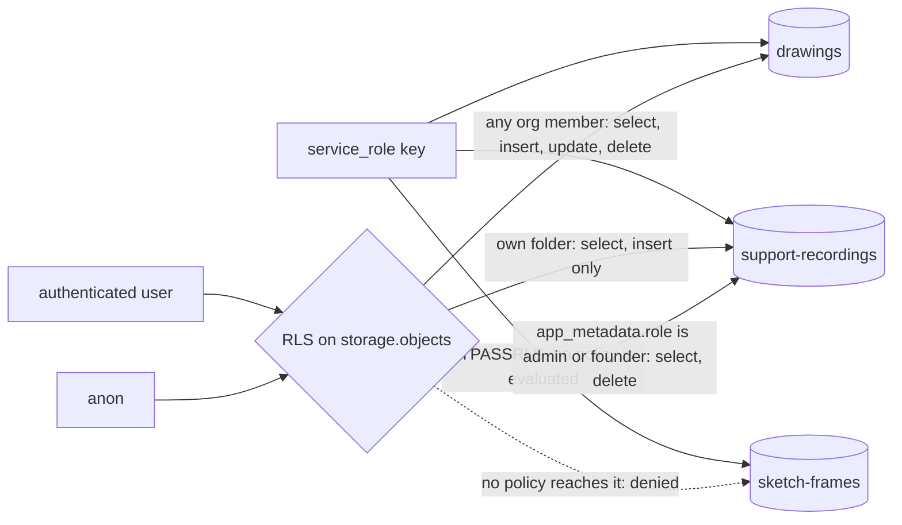

# Supabase storage schema

Supabase's `storage` schema — where the paths in
[`database-schema.md`](./database-schema.md) actually resolve. Every
`geometry_path`, `reference_path` and `recording_path` in `public` is a key into
`storage.objects`; nothing in Postgres joins the two.

Eight tables, five foreign keys, and ten row-level security policies that are
the real subject of this file. As in
[`auth-schema.md`](./auth-schema.md), the columns are from the schema dump and
the constraints, policies and role attributes were read from the live database
rather than inferred — [the queries are at the bottom](#the-queries-behind-this-file).

## The tables



`buckettype` is `STANDARD`, `ANALYTICS` or `VECTOR`. `migrations` and
`buckets_analytics` stand alone — no foreign keys in either direction.

## Who can reach what

Ten policies, all of them on `objects`. The other seven tables have RLS enabled
and no policies at all, which denies everything to `authenticated` and `anon`.



The two policies named `service_role storage insert` and
`service_role storage select` are drawn going around the gate on purpose. See
the first finding below.

| Bucket | Who | May |
|---|---|---|
| `drawings` | any member of the project's org | select, insert, update, delete |
| `support-recordings` | the owner of the first path segment | select, insert |
| `support-recordings` | `app_metadata.role` of `admin` or `founder` | select, delete |
| `sketch-frames` | `service_role` only | everything, by bypass |

Both buckets derive permission from the object's own path: `drawings` takes the
project id from `split_part(name, '/', 1)`, `support-recordings` takes the user
id from `(storage.foldername(name))[1]`. The path is the authorization, so a bug
in path construction is a permission bug.

## What the policies actually do

- **`service_role` bypasses RLS, so its two policies restrict nothing.** The
  role carries the `BYPASSRLS` attribute, which means no policy on `objects` is
  ever evaluated for it. The names read like a confinement to `sketch-frames`;
  there is none. A leaked or misused service-role key reads and writes
  `drawings` and `support-recordings` too. Confining the server to one bucket
  has to happen in application code, or by giving it a role that does not
  bypass — the policies as written cannot do it.

- **A `viewer` can overwrite and delete drawings.** All four `drawings_*`
  policies test membership and nothing else: `om.user_id = auth.uid()`. None of
  them reads `om.role`, confirmed against `pg_policy`. `org_members.role` is
  constrained to `owner`, `editor` or `viewer`, and storage honours none of the
  three — so a user invited to look at a project can replace its geometry or
  delete it, for every project in the org. If the role column is meant to mean
  anything here, the three write policies need `and om.role in ('owner',
  'editor')`; `drawings_select` is correct as it stands.

- **The missing `WITH CHECK` on `drawings_update` is not a hole.** When an
  UPDATE policy omits it, Postgres reuses the `USING` expression as the check,
  so the *new* name is tested by the same rule. A file cannot be renamed into a
  project you do not belong to. It can still be moved between two projects you
  do belong to, which is the weaker statement the policy actually makes.

- **`app_metadata`, correctly.** The two admin policies read
  `auth.jwt() -> 'app_metadata' ->> 'role'`. That claim is server-writable only.
  The neighbouring `user_metadata` is writable by any client, and reading the
  role from there instead would let a user promote themselves to founder and
  read every support recording in the project.

- **Nobody can delete their own recording.** `support-recordings` grants the
  owner insert and select, and delete only to admin or founder — which lines up
  with `support_messages.recording_deleted_at` being the server's to set.

## Operational notes

- **A bucket cannot be dropped while it holds objects.** `objects.bucket_id`,
  and both `s3_multipart_uploads` keys, are `NO ACTION` — not cascade. Only
  `s3_multipart_uploads_parts` cascades, from its parent upload. Empty the
  bucket first, or the delete errors.
- **`vector_indexes.bucket_id` points at `buckets_vectors`, not `buckets`.**
  Two separate registries that a name-matched diagram would wire together
  wrongly.
- **RLS is on for all eight tables; only `objects` has policies.** The other
  seven are therefore deny-all for `authenticated` and `anon` — a client cannot
  list buckets. `FORCE ROW LEVEL SECURITY` is off everywhere, so the tables'
  owner still reads them, which is how the Storage API keeps working.
- **`auth.uid()` is re-evaluated per row** inside those `EXISTS` subqueries.
  Wrapping it as `(select auth.uid())` lets Postgres hoist it into an InitPlan
  and run it once per statement, which is the difference that shows on a large
  listing.
- **`p.id::text = split_part(...)` cannot use `projects_pkey`.** Casting the
  uuid to text defeats the btree index, and `projects` carries no functional
  index on `(id::text)` — verified. Casting the other way would be worse: a
  path whose first segment is not a uuid would raise instead of denying. A
  functional index on `((id)::text)` gets the lookup back without changing the
  policy's behaviour.

## The queries behind this file

```sql
-- foreign keys, RLS state and policy count, per storage table
select c.conrelid::regclass::text, c.confrelid::regclass::text, c.confdeltype
from pg_constraint c
where c.contype = 'f' and c.connamespace = 'storage'::regnamespace;

select cl.relname, cl.relrowsecurity, cl.relforcerowsecurity,
       (select count(*) from pg_policy p where p.polrelid = cl.oid) as policies
from pg_class cl join pg_namespace n on n.oid = cl.relnamespace
where n.nspname = 'storage' and cl.relkind = 'r';

-- which roles ignore RLS entirely
select rolname, rolbypassrls from pg_roles
where rolname in ('anon', 'authenticated', 'service_role', 'postgres');

-- does any drawings_* policy actually look at the member's role?
select polname,
       (coalesce(pg_get_expr(polqual, polrelid), '') ||
        coalesce(pg_get_expr(polwithcheck, polrelid), '')) ilike '%om.role%'
from pg_policy where polrelid = 'storage.objects'::regclass;
```

The last one returns false for all four `drawings_*` policies today. When that
changes, the second finding above is fixed.
